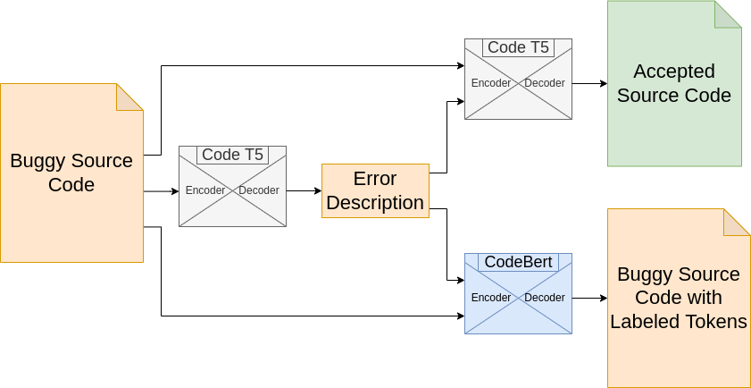

# Bug Detection and Repair

This repository contains the script used for dataset generation
[codenet.py](codenet.py). We have also added some exploratory data analysis
notebooks for the generated dataset. The `docker-example` folder contains the
demo for the bug detection and repair pipeline and uses models trained on the
codenetpy dataset. The demo application is created using the Streamlit python
library and runs on localhost. Finally we have included a REST API endpoint, in
`rest-api` that can be used to deploy a backend for a custom frontend
application. We have used Flask and gunicorn for deployment inside Docker.

The generated dataset and the notebooks used to train the model can be found on
Kaggle. Dataset can be found
[here](https://www.kaggle.com/datasets/alexjercan/codenetpy). Trained models
can be found [here](https://huggingface.co/alexjercan).

## About the Dataset

### Context

Source code related tasks for machine learning have become important with the
large need of software production. In this dataset our main goal is to create a
dataset for bug detection and repair.

### Content

The dataset is based on the CodeNet project and contains python code
submissions for online coding competitions. The data is obtained by selecting
consecutive attempts of a single user that resulted in fixing a buggy
submission. Thus the data is represented by code pairs and annotated by the
diff and error of each changed instruction. We have already tokenized all the
source code files and kept the same format as in the original dataset.

The dataset file contains source code pairs in json format as a list of
objects. Each object contains the "original\_src": source code of the buggy
submission file, the "changed\_src": source code of the accepted submission,
"problem\_id" identifier for the problem (there are multiple submissions for the
same problem), "original\_id" and "changed\_id" identifiers for the submissions,
"language": programming language (Python), "filename\_ext": extension of the
source code file (.py), "original\_status": status of the original submission on
the online competition (mostly runtime errors), "returncode": the return code
on the example input and output for the original submission, "error\_class":
parsed error of the original submission on the example input,
"error\_class\_extra": same as error\_class but with extra information, "error":
the error string as it appears in the console, "output": the output of the run,
if there was one.

### Acknowledgements

CodeNet: A Large-Scale AI for Code Dataset for Learning a Diversity of Coding
Tasks

## About the Model

### Bug Detection

For the bug detection stage we have used the CodeT5 architecture. In our
development we have used pretrained weights on the CodeSearchNet dataset. We
fine tuned the CodeT5 model for the task of error description prediction on our
CodeNetPy dataset. We have used preprocessed error messages from running the
buggy submissions as training data. These error messages consist of the type of
the error and a short description containing the location and features of the
parts of the program involved in the crash.

### Bug Localization

In the bug localization phase we have used the CodeBert architecture. The
weights we have used for this model are also pretrained on the CodeSearchNet
dataset. In our case we want to make a binary prediction for each token in our
buggy source code. To fine tune the model to work for our task we have used
both the buggy and accepted source code to generate the difference string.
After we compare the buggy source code with the diff file we can generate
ground truth labels for what changed from one submission to another. This
information will represent the training data and what we want the model to be
able to predict. The model will receive as input the error description, which
is ideally predicted by the bug detection stage, and the buggy source code. The
model will tokenize and concatenate the inputs and then generate a binary mask
for the tokens. The bug localization task has the objective to help the
programmer find the location of the bug predicted during the first phase of
the pipeline.

### Bug Repair

Since the bug repair task is very similar to a neural machine translation
problem we have decided to also use CodeT5 for this phase too. We have used the
same pretrained weights as for the bug detection task and we have fine tuned
the model to be able to predict accepted source code from buggy source code.
The model input consists of the error description and the buggy source code and
will output a modified version of the original source code which should be able
to be accepted in the competition.
