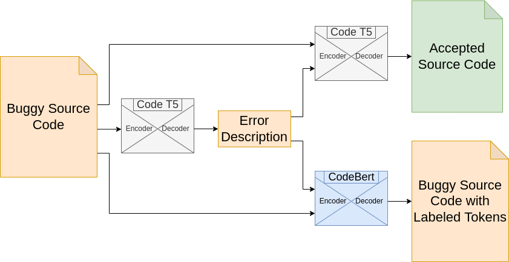

# Bug Detection and Repair

Examples for the bug detection and pipeline that I implemented for my first
year of Masters.

## Content

The `docker-example` folder contains the demo for the bug detection and repair
pipeline and uses models trained on the `CodeNetPy` dataset. The demo
application is created using the Streamlit python library and runs on
localhost. Finally we have included a REST API endpoint, in `rest-api` that can
be used to deploy a backend for a custom frontend application. We have used
Flask and gunicorn for deployment inside Docker.

1. To run the streamlit demo see [docker-example](./docker-example)

2. To run the REST API see [rest-api](./rest-api)

## About the Models

Trained models can be found [here](https://huggingface.co/alexjercan).

### Bug Detection

For the bug detection stage we have used the CodeT5 architecture. In our
development we have used pretrained weights on the CodeSearchNet dataset. We
fine tuned the CodeT5 model for the task of error description prediction on our
CodeNetPy dataset. We have used preprocessed error messages from running the
buggy submissions as training data. These error messages consist of the type of
the error and a short description containing the location and features of the
parts of the program involved in the crash.

### Bug Localization

In the bug localization phase we have used the CodeBert architecture. The
weights we have used for this model are also pretrained on the CodeSearchNet
dataset. In our case we want to make a binary prediction for each token in our
buggy source code. To fine tune the model to work for our task we have used
both the buggy and accepted source code to generate the difference string.
After we compare the buggy source code with the diff file we can generate
ground truth labels for what changed from one submission to another. This
information will represent the training data and what we want the model to be
able to predict. The model will receive as input the error description, which
is ideally predicted by the bug detection stage, and the buggy source code. The
model will tokenize and concatenate the inputs and then generate a binary mask
for the tokens. The bug localization task has the objective to help the
programmer find the location of the bug predicted during the first phase of
the pipeline.

### Bug Repair

Since the bug repair task is very similar to a neural machine translation
problem we have decided to also use CodeT5 for this phase too. We have used the
same pretrained weights as for the bug detection task and we have fine tuned
the model to be able to predict accepted source code from buggy source code.
The model input consists of the error description and the buggy source code.
Based on the bug localization results, we replace the source code that is
labeled as buggy with a `<MASK>` token and we train the T5 model to predict
only the replacement for that part. This is an upgrade to what we did in the
past, where we tried to generate the entire source code from scratch.
