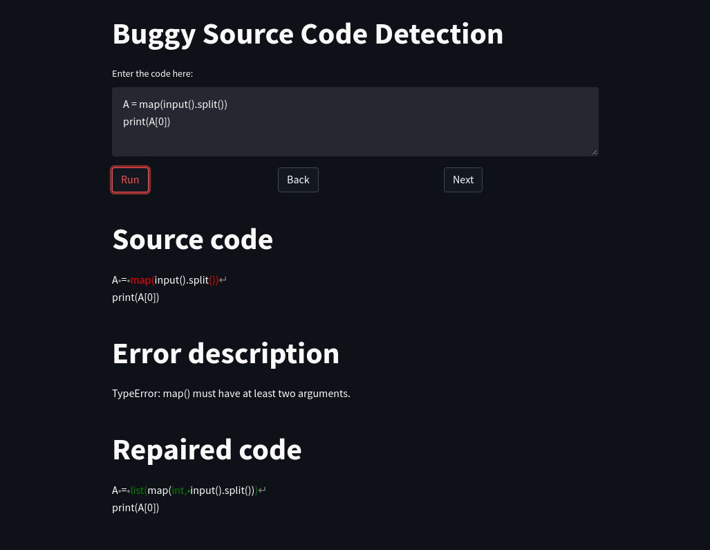

# Bug Detection Container

Docker image using streamlit to test the bug detection pipeline.



## Quickstart

### Docker Compose

```console
docker compose up
```

### Docker

```console
docker build . --tag bug-detection-v1
docker run --it -p 8051:8051 bug-detection-v1:latest
```

### Streamlit

```console
pip install -r requirements.txt
streamlit run app.py
```

This will download all the dependencies from `requirements.txt` and the models
from huggingface. Then it will run the Streamlit application on the address:
`localhost:8051`.
